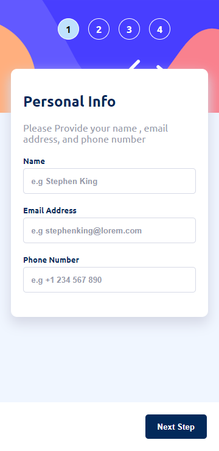
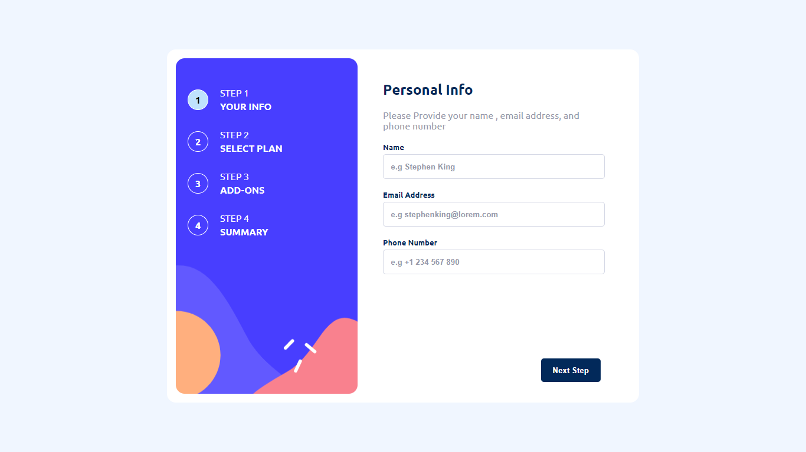

# Frontend Mentor - Multi-step form solution

This is a solution to the [Multi-step form challenge on Frontend Mentor](https://www.frontendmentor.io/challenges/multistep-form-YVAnSdqQBJ). Frontend Mentor challenges help you improve your coding skills by building realistic projects. 

## Table of contents

- [Overview](#overview)
  - [The challenge](#the-challenge)
  - [Mobile Screenshot](#mobile-screenshot)
  - [Desktop Screenshot](#desktop-screenshot)
  - [Links](#links)
- [My process](#my-process)
  - [Built with](#built-with)
  - [What I learned](#what-i-learned)
- [Author](#author)

## Overview

### The challenge

Users should be able to:

- Complete each step of the sequence
- See a summary of their selections on the final step and confirm their order
- View the optimal layout for the interface depending on their device's screen size
- See hover and focus states for all interactive elements on the page

### Mobile Screenshot

### Mobile Screenshot


### Desktop Screenshot


### Links

- Solution URL: [Add solution URL here](https://github.com/ovie009/multi-step-form)
- Live Site URL: [Add live site URL here](https://ovie-multi-step-form.netlify.app/)

## My process

### Built with

- CSS Flex
- Mobile-first workflow
- [React](https://reactjs.org/) - JS library

### What I learned
```js
x = 3;
const randomFunction1 = () => {
  return ++x;
}

const randomFunction2 = () => {
  return x++;
}
```
randomFunction1 and randomFunction2 would not produce the same results,
function 1 increases the value before it is returned, function 2 returns the value then increases it.

## Author

- Website - [Iffie Ovie](https://iffieovie.netlify.com)
- Frontend Mentor - [@ovie009](https://www.frontendmentor.io/profile/ovie009)
- Twitter - [@iffieOvie](https://www.twitter.com/iffieoive)
